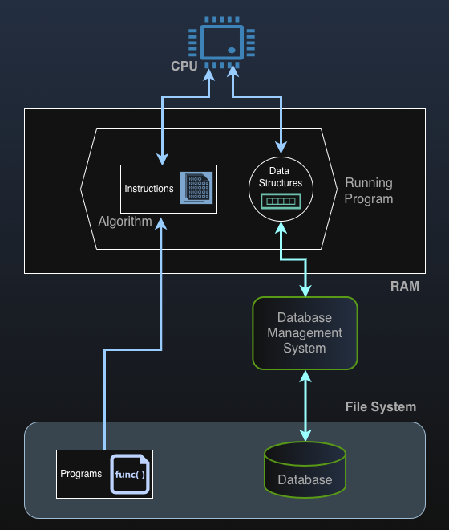
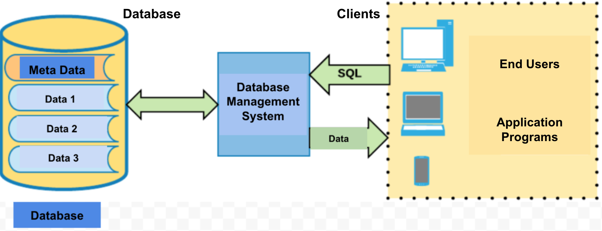

# Module 1: Database Management Systems (DBMS)

---

<!-- TOC -->
* [Module 1: Database Management Systems (DBMS)](#module-1-database-management-systems-dbms)
  * [Introduction to Database Management Systems (DBMS)](#introduction-to-database-management-systems-dbms)
  * [The Use of Databases in Various Sectors](#the-use-of-databases-in-various-sectors)
  * [Data and Information](#data-and-information)
  * [Database System](#database-system)
  * [Database System Environment](#database-system-environment)
  * [Essential Features of a Database Management System (DBMS)](#essential-features-of-a-database-management-system-dbms)
  * [Some Well-Known Relational Database Management Systems (RDBMS)](#some-well-known-relational-database-management-systems-rdbms)
  * [Some Well-Known NoSQL Database Management Systems (NoSQL DBMS)](#some-well-known-nosql-database-management-systems-nosql-dbms)
  * [Setting up the development environment](#setting-up-the-development-environment)
    * [PostgreSQL (for relational DB Operations)](#postgresql-for-relational-db-operations)
    * [Designing ER diagrams](#designing-er-diagrams-)
    * [MongoDB (for NoSQL DB Operations)](#mongodb-for-nosql-db-operations)
    * [IntelliJ IDEA  (https://www.jetbrains.com/idea/download) (for Java Development, Unit Tests, TDD, BDD)](#intellij-idea-httpswwwjetbrainscomideadownload-for-java-development-unit-tests-tdd-bdd)
<!-- TOC -->

---

## Introduction to Database Management Systems (DBMS)

* A **database** is a persistent and organized collection of related data designed for efficient storage, retrieval,
  manipulation, management, and protection.
* A **Database Management System (DBMS)** is specialized software that controls and manages databases and
  provides interfaces for database clients to store, retrieve, and manipulate data efficiently.

As applications grow in size and complexity, managing data directly through files and in-memory structures becomes 
inefficient, error-prone, and difficult to scale. A Database Management System (DBMS) provides a systematic way to 
store, organize, retrieve, and protect large volumes of persistent data while ensuring efficiency, consistency, 
security, and concurrent access by multiple users and applications. By abstracting low-level storage details and 
optimizing data access, a DBMS enables programs to focus on problem-solving logic rather than data handling, making 
it an essential component of modern software systems.

In summary:
* Data originates from the problem domain.
* Programs process it using algorithms, executed by the CPU.
* Data is temporarily stored in RAM as data structures.
* Fast access is provided by RAM.
* Persistent, structured, and shared data is managed by a DBMS, which ensures long-term retention.

---

## The Use of Databases in Various Sectors

Databases play a critical role in modern society and are widely used across a broad range of industries and institutions. 
They enable organizations to store, manage, and analyze large volumes of data efficiently and reliably. 
Common sectors that rely heavily on database systems include:

Databases play a critical role in modern society and are widely used across many industries and institutions, 
including, but not limited to:

- Finance
- Education
- Transportation
- Logistics
- Communication
- Media
- Healthcare
- Information Technology
- Manufacturing

In all these sectors, databases support daily operations, enable informed decision-making, and ensure the reliability 
and availability of critical data.

---

## Data and Information

- Raw facts that have not been processed or given meaning are referred to as **data**.
- When data is processed, organized, or analyzed, it is transformed into meaningful **information**.
- **Information** represents the meaning derived from data and provides context.
- Context is obtained by associating data with other related data.

**Example:**

> 80

This number, as raw data without context, has no clear meaning on its own.

> 80 is the final exam score of Student A in the Database course.

By associating it with other data (such as the student, course, and assessment type), 
we provide **context**, allowing us to understand its meaning as information.

- Accurate, relevant, and timely information is essential for effective **decision-making**.
- Making correct and informed decisions is crucial for the **survival and success of organizations**.
- **Data management** is one of the most fundamental activities in any organization.
- Data management is the discipline concerned with the proper **generation, storage, organization, access, and 
protection** of data.

***Database Management Systems (DBMSs) are specialized software systems that manage data and enable its transformation 
into meaningful information.***

---

## Database System
A **Database System** consists of three main parts:
- **Database** = Raw Data + Metadata (used to define relationships and data characteristics, forming the logical 
structure of the database).
- **DBMS (Database Management System)** 
- **Database clients** = Application software or database client tools that interact with the DBMS.

---

## Database System Environment

A database system operates within an environment composed of several interrelated components:

**Hardware**
- Servers, workstations, network infrastructure, storage devices, RAID systems, etc.

**Software**
- **Operating Systems**
- **Database Management Systems (DBMSs)**: PostgreSQL, MySQL, DB2, Oracle, MSSQL, Cassandra, MongoDB, Redis, etc.
- **Application programs and utility tools**

**People**
- System administrators
- Database administrators (DBAs)
- Database designers
- Application developers
- End users

**Data**
- **At the center of everything**: the core resource that the entire system is designed to store, manage, and provide access to efficiently.

---

## Essential Features of a Database Management System (DBMS)

- **Data Integration**  
  Efficiently manages and organizes data to avoid unnecessary duplication, which can lead to anomalies in insert, 
  update, and delete operations.
  - *Relational DBMSs* enforce structured relationships among data.
  - *NoSQL systems* focus on flexible data organization to handle diverse and evolving data types.

- **Data Integrity**  
  Ensures that data remains accurate, consistent, and reliable over time.
  - *Relational DBMSs* enforce integrity through schemas and constraints, such as primary and foreign keys.
  - *NoSQL systems* often relax these rules to achieve higher performance and scalability.

- **Data Security**  
  Protects data from unauthorized access, system failures, and attacks.
  - Both SQL and NoSQL systems implement mechanisms such as authentication, authorization, and backup, though 
    implementation methods may differ.

- **Data Abstraction**  
  Provides a logical view of data, hiding the complexity of underlying storage structures.
  - *Relational DBMSs* organize data in tables with defined schemas.
  - *NoSQL systems* use alternative models such as key-value stores, documents, wide-column stores, or graphs.

---

## Some Well-Known Relational Database Management Systems (RDBMS)

- **PostgreSQL** – An advanced open-source RDBMS with strong support for SQL and some NoSQL features, known for data integrity, extensibility, and reliability.
- **MySQL** – An open-source RDBMS known for its speed, ease of use, and reliability, widely used in web applications and data-driven platforms.
- **Oracle Database** – A commercial RDBMS used in enterprise applications, offering high performance, strong security, and scalability.
- **Microsoft SQL Server** – A robust RDBMS from Microsoft, widely used in business applications and tightly integrated with Windows environments.
- **SQLite** – A lightweight, embedded RDBMS often used in mobile applications and local storage, without requiring a separate server.
- **IBM Db2** – A high-performance RDBMS designed for large-scale enterprise applications, offering AI-driven optimizations.
- **MariaDB** – A MySQL-compatible open-source database known for enhanced performance, security, and scalability.

---

## Some Well-Known NoSQL Database Management Systems (NoSQL DBMS)

- **MongoDB** – A popular document-oriented database that stores data in flexible JSON-like documents, ideal for dynamic and evolving datasets.
- **Cassandra** – A highly scalable wide-column store designed for handling large volumes of distributed data across multiple nodes with high availability.
- **Redis** – An in-memory key-value store known for extreme speed, used for caching, real-time analytics, and messaging.
- **Couchbase** – A distributed NoSQL document database combining key-value access with flexible queries and full-text search capabilities.
- **Neo4j** – A graph database optimized for storing and querying highly connected data, widely used in social networks and recommendation engines.
- **Amazon DynamoDB** – A fully managed key-value and document database service offered by AWS, known for automatic scaling and high availability.
- **Firebase Realtime Database** – A cloud-hosted NoSQL database for real-time synchronization in mobile and web applications.

---

## Setting up the development environment

To practice throughout this course, install/register/configure the following tools:

---

### PostgreSQL (for relational DB Operations)
- PostgreSQL is an open-source and powerful relational database management system.
- Complies with SQL standards and supports Linux, macOS, and Windows.
- Download Link: [Download PostgreSQL](https://www.postgresql.org/download/) any version that can
  be installed without issues.
* For setting up the working environment, refer to Module 4.

---

### Designing ER diagrams 

Draw.io (now also known as diagrams.net) is a free and web-based diagramming tool used to design Entity Relationship(ER)  
models.

---

  
### MongoDB (for NoSQL DB Operations)
* For setting up the working environment, refer to Module 7.

---

### IntelliJ IDEA (for Java-Based Program Development)
- Popular IDE for Java based development.
- For accessing a free IDE (Ultimate), you can visit (https://www.jetbrains.com/shop/eform/students)
- Download Link: [IntelliJ](https://www.jetbrains.com/idea/download)

- File -> New -> Project -> Java
  - give a name, choose a location
  - Build system: Maven
  - JDK -> choose a proper JDK, download if not exist
  - check "add sample code" option
  - write the following code snippet

~~~java
/**
 * Must be stored as HelloWorld.java
 *
 */
public class HelloWorld {

    public static void main(String[] s) {

        System.out.println("Hello World");
    }

}
~~~

- Open a terminal
- Compiling
~~~console
javac HelloWorld.java
~~~

- Running
~~~console
java HelloWorld.java
~~~

- Output
~~~console
Hello World
~~~
