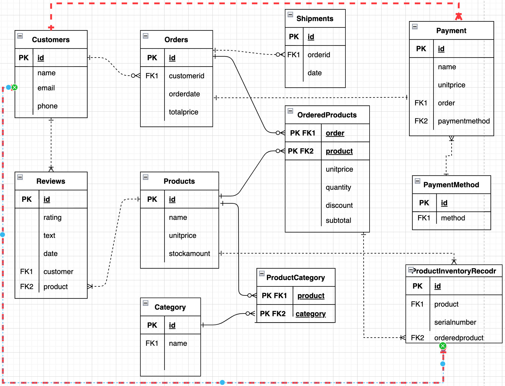

# Module 2: Database Design & Entity–Relationship (ER) Model

<!-- TOC -->
* [Module 2: Database Design & Entity–Relationship (ER) Model](#module-2-database-design--entityrelationship-er-model)
  * [1. Database Development Lifecycle](#1-database-development-lifecycle)
  * [2. Business Rules](#2-business-rules)
  * [3. Data Model](#3-data-model)
    * [3.1. Evolution of Data Models](#31-evolution-of-data-models)
      * [Early Data Models (Historical)](#early-data-models-historical)
      * [Modern and Conceptual Data Models](#modern-and-conceptual-data-models)
      * [Emerging and Alternative Data Models](#emerging-and-alternative-data-models)
  * [4. Entity–Relationship (ER) Model](#4-entityrelationship-er-model)
    * [4.1. Benefits of ER Modeling](#41-benefits-of-er-modeling)
    * [4.2. Why Data Modeling Matters for Different Database Systems](#42-why-data-modeling-matters-for-different-database-systems)
    * [4.3. Key Components of the ER Model](#43-key-components-of-the-er-model)
    * [4.4. Transforming Business Rules into an ER Model](#44-transforming-business-rules-into-an-er-model)
      * [Examples: Business Rules to ER Model](#examples-business-rules-to-er-model)
      * [Relationship Types (Cardinalities)](#relationship-types-cardinalities)
    * [4.5. Types of Attributes](#45-types-of-attributes)
  * [5. Designing ER Diagrams Using Crow’s Foot Notation](#5-designing-er-diagrams-using-crows-foot-notation)
    * [5.1. Crow’s Foot Symbols Explanation](#51-crows-foot-symbols-explanation)
      * [Cardinality vs. Participation in ER Modeling](#cardinality-vs-participation-in-er-modeling)
      * [One-to-Many (1:M) Relationship](#one-to-many-1m-relationship)
      * [Many-to-Many (M:N) Relationship](#many-to-many-mn-relationship)
      * [One-to-One (1:1) Relationship](#one-to-one-11-relationship-)
<!-- TOC -->

---

## 1. Database Development Lifecycle

The **Database Development Lifecycle** is a structured process used to design and build high-quality databases in a 
systematic and efficient way. It breaks database development into distinct phases, each with specific goals and 
deliverables. 

The Database Development Lifecycle typically consists of four fundamental phases.

---

**1. Requirement Analysis**
- Identify and document **business needs**, **processes**, and **data requirements**.
- Define **business rules** that govern how data should be used and constrained.

**Roles Involved:** Business Analysts, Project Managers, Stakeholders/Clients  
**Output:** Requirements Specification Document

---

**2. Design**
- Develop the **data model** to represent entities, attributes, and relationships (ER Diagram).
- Convert the conceptual model into a **logical schema** with **tables, columns, primary/foreign keys, and constraints**.
- Ensure that the design supports business rules, normalization, and integrity requirements.

**Roles Involved:** Data Architects, Database Designers, Data Modelers  
**Output:** Database Design Document (ER Diagram + Logical Schema)

---

**3. Implementation**
- Build and configure the database using **DBMS tools and SQL (or NoSQL commands)**.
- Populate the database with initial data and test for **structural integrity and performance**.

**Roles Involved:** Database Developers, Database Administrators (DBAs)  
**Output:** Operational Database

---

**4. Maintenance**
- Monitor database performance and ensure **availability, security, and reliability**.
- Apply **updates, optimizations, and patches** as needed.
- Handle **data backup, recovery, and tuning** tasks over time.

**Roles Involved:** Database Administrators (DBAs), System Administrators  
**Output:** Stable, Optimized, and Secure Database System

---

## 2. Business Rules

Specific statements that define or constrain business data and operations. They often originate from 
requirement list.

* Data-oriented business rules → Define how data is structured and related (e.g., entities, attributes, relationships, 
constraints). They are used to design and build the database.
* Process-oriented business rules → Define business actions or workflows (e.g., approval steps, procedures). They are
  implemented in application logic, not database structure.

**Sources of Business Rules**

- **End users**
- **Managers and policymakers**
- **Written documentation** such as standards, regulations, and procedures

Direct interaction with **end users** ensures a clearer understanding of actual data needs and system expectations.

**Examples of Business Rules**

- An employee can belong to only one department.
- A customer must provide a valid email.
- A student can enroll in many courses, and a course can have many students.
- An order must include at least one product.
- A customer can place multiple orders, but each order is placed by only one customer.

Data-oriented business rules help identify **entities, attributes, relationships, and constraints** 
when developing the **Entity-Relationship (ER) model**.  

Once these rules are defined, the next step is to **model the database** to implement them effectively.

---

## 3. Data Model

A **data model** is a conceptual tool used to represent complex real-world data structures in a simplified and often **graphical** form.  
In this course, data modeling serves as the **foundation for understanding both relational and NoSQL database systems**.

---

### 3.1. Evolution of Data Models

Over time, database systems have evolved to address increasing data complexity, scalability requirements, and application needs.

In the early days of database systems, several data models were introduced. While these models were **influential historically**, they are **rarely used in modern software development** today. Modern applications primarily rely on **relational** and **NoSQL-based** data models due to their flexibility, scalability, and ease of integration with contemporary software systems.

---

#### Early Data Models (Historical)

- **File System**
  - Data is stored in separate files without structured relationships.
  - Leads to data redundancy, inconsistency, and difficult data management.

- **Hierarchical Model**
  - Data is organized in a **tree-like structure** with parent–child relationships.
  - Efficient for one-to-many relationships but inflexible for complex associations.
  - Speed up the search performance compared to file system.

- **Network Model**
  - Data is organized using **graph-like structures**, allowing many-to-many relationships.
  - More flexible than the hierarchical model, but complex to design and maintain.

---

#### Modern and Conceptual Data Models

- **Entity–Relationship (ER) Model**
  - A **conceptual data model** used during database design.
  - Represents data using **entities, attributes, and relationships**.
  - Serves as a bridge between real-world requirements and relational database implementation.

- **Relational Model**
  - Stores data in **tables (relations)** with well-defined schemas.
  - Relationships are enforced using **primary keys and foreign keys**.
  - Forms the foundation of most traditional database systems.

- **Object-Oriented Model**
  - Integrates **object-oriented programming concepts** (classes, objects, inheritance) with databases.
  - Useful for applications developed using object-oriented languages.

---

#### Emerging and Alternative Data Models

- **New Data Models**
  - Include **NoSQL databases**, **graph databases**, **vector databases**, and other emerging models.
  - Designed to handle **large-scale, distributed, and unstructured or semi-structured data**.
  - Emphasize **scalability**, **high availability**, and **flexible schemas** over rigid structure.
  - **Vector databases** are optimized for storing and searching high-dimensional vector embeddings,
    commonly used in **AI, machine learning, recommendation systems, and semantic search**.
  - Emphasize scalability, high availability, and flexible schemas over strict structure.

---

## 4. Entity–Relationship (ER) Model

The **Entity–Relationship (ER) Model** is a **conceptual representation of data** that describes the structure of a database using the following core components:

---

### 4.1. Benefits of ER Modeling
1. **Improves Communication**
- Facilitates clear communication between database designers, developers, and end users.
- Ensures that all stakeholders share a common understanding of the data structure before implementation.

2. **Guides Database Implementation**
- Serves as a blueprint for designing relational or other database schemas.

---

### 4.2. Why Data Modeling Matters for Different Database Systems

Data modeling is essential regardless of the database technology used; however, **how strictly a model is enforced differs** between relational and NoSQL systems.

- **Relational databases** rely on **well-defined schemas** derived directly from data models such as the ER model.
- **NoSQL databases** often use **flexible or schema-less designs**, but still require a clear understanding of entities,
  relationships, and access patterns.

---

### 4.3. Key Components of the ER Model

- **Entities**  
  Represent real-world objects about which data is collected and stored  
  (e.g., `Student`, `Course`, `Employee`).

- **Attributes**  
  Describe the characteristics or properties of an entity  
  (e.g., `Name`, `ProductCode`, `UnitPrice`).

- **Relationships**  
  Define associations between entities. Common relationship types (cardinalities) include:
  - **One-to-Many (1:M)**
  - **Many-to-Many (M:N)**
  - **One-to-One (1:1)**

>In relational databases, relationships are enforced using **foreign keys**.  
>In NoSQL systems, relationships are often **embedded, referenced, or handled at the application level**.

- **Constraints**  
  Enforce business rules to preserve data accuracy and consistency, for example:
  - An employee’s age must be between 18 and 65.
  - A phone number must follow the format `(XXX) XXX-XXXX`.
  - Each email address must be unique in the system.

>Relational databases strictly enforce constraints, whereas NoSQL systems may relax constraints to improve 
> **scalability and performance**.

---

### 4.4. Transforming Business Rules into an ER Model

Business rules describe how an organization operates and are the **foundation of data modeling**.

General guidelines:

- **Nouns or noun phrases** in business rules are candidates for:
  - **Entities** (if they have properties)
  - **Attributes** (if they describe properties of entities)

- If **two entities appear in the same sentence**, there is usually a **relationship** between them.

This is a basic guideline, but through practical exercises, you can develop a deeper understanding and gain experience 
in identifying entities, attributes, and relationships more effectively.

---

#### Examples: Business Rules to ER Model

**1. Entities and Attributes**

- A **Customer** has a first name, last name, customer number, and address.
- An **Invoice** has an invoice number, date, and total amount.

→ `Customer` and `Invoice` are entities; listed properties are attributes.

---

**2. Relationships**

- A **Customer** can generate many **Invoices**.

→ **One-to-Many (1:M)** relationship.

---

#### Relationship Types (Cardinalities)

Relationships are **bidirectional**, and its type (cardinality) is determined by asking:
> *How many instances of one entity can be associated with the other?*
> or
> *What is the maximum number of Entity1 per Entity2*

**Examples:**

**One-to-Many (1:M) Relationship (Doctor – Prescription)**

- A **Doctor** can issue `many` **Prescriptions**.  
  Each **Prescription** is issued by only `one` **Doctor**.  
  → **1:M**

- *What is the maximum number of prescriptions per doctor?* → **many**  → **Cardinality**
- *What is the maximum number of doctors per prescription?* → **one**  → **Cardinality**

---

**One-to-Many (1:M) Relationship (Instructor – Course)**

- One **Instructor** can teach **many Courses**.  
  Each **Course** is taught by only **one Instructor**.  
  → **1:M**

- *What is the maximum number of courses per instructor?* → **many** → **Cardinality**
- *What is the maximum number of instructors per course?* → **one** → **Cardinality**

---

**One-to-One (1:1) Relationship (Person – Department (Manager))**

- One **Person** can manage **one Department**.  
  Each **Department** has only **one Manager**.  
  → **1:1**

- *What is the maximum number of departments per person?* → **one** → **Cardinality**
- *What is the maximum number of managers per department?* → **one** → **Cardinality**

---

**Many-to-Many (M:N) Relationship (Student – Course)**

- One **Student** can enroll in **many Courses**.  
  Each **Course** can have **many Students**.  
  → **M:N**

- *What is the maximum number of courses per student?* → **many** → **Cardinality**
- *What is the maximum number of students per course?* → **many** → **Cardinality**

### 4.5. Types of Attributes

- **Simple**  
  Single-valued attributes (e.g., `Name`).

- **Composite**  
  Can be divided into smaller parts  
  (e.g., `FullName → FirstName + LastName`).

- **Derived**  
  Computed from other attributes  
  (e.g., `Age` derived from `DateOfBirth`).

- **Multivalued**  
  Can have multiple values  
  (e.g., `PhoneNumbers`).

---

> **In summary:**  
> Transforming business rules into an ER model ensures correct identification of entities, attributes, relationships, 
> and constraints, forming a solid conceptual foundation for database design.

## 5. Designing ER Diagrams Using Crow’s Foot Notation

Crow’s Foot notation is commonly used to represent **relationships and cardinalities** between entities in ER diagrams. 
It visually expresses how many instances of one entity can be associated with another.

Different notations can be used for ER modeling:

- **Chen Notation**
  - Emphasizes conceptual clarity.
  - Clearly represents entities, attributes, and relationships.

- **Crow’s Foot Notation**
  - More implementation-oriented.
  - Widely used in relational database design.

- **UML Notation**
  - Can be used for both conceptual and implementation modeling.
  - Common in object-oriented system design.

---

### 5.1. Crow’s Foot Symbols Explanation

#### Cardinality vs. Participation in ER Modeling

In Entity–Relationship (ER) modeling, each side of a relationship is defined using two constraints:
**maximum cardinality** and **minimum participation**.

**Cardinality** describes the maximum number of times an instance in one entity can be associated with instances in the 
related entity.

**Participation** (also called Optionality) describes the minimum number of times an instance in one entity must be 
associated with an instance in the related entity.

**Cardinality Symbols**

| Symbol            | Meaning | Explanation |
|-------------------|-------|-------------|
| I                 | One | Exactly one instance |
| `<` (crow’s foot) | Many | Zero or more / many instances |

---

**Participation(Optionality) Symbols:**

| Symbol | Meaning | Explanation |
|--------|-------|-------------|
| `O`    | Optional | Participation is not required (zero allowed) |
| I      | Mandatory | Participation is required (at least one) |

**To determine the cardinality and participation:**

| Concept | Question Answered | Meaning |
|------|------------------|--------|
| Cardinality | What is the **maximum** number? | One or many |
| Participation | What is the **minimum** number? | Optional (0) or mandatory (1) |

---

#### One-to-Many (1:M) Relationship

**Example: Doctor – Prescription (One-to-Many Relationship)**

**Relationship Description:**
- A **Doctor** can issue **many Prescriptions**.
- Each **Prescription** is issued by **exactly one Doctor**.

**Cardinality and Participation Interpretation:**

- **Prescription side in the diagram**
  - *What is the maximum number of `Prescription` per `Doctor`?* → **many**  → **Cardinality**
  - *What is the minimum number of `Prescription` per `Doctor`?* → **zero**  → **Participation (optional)**

- **Doctor side in the diagram**
  - *What is the maximum number of `Doctor` per `Prescription`?* → **one**  → **Cardinality**
  - *What is the minimum number of `Doctor` per `Prescription`?* → **one**  → **Participation (mandatory)**

Doctor || ----------- 0< Prescriptions

This represents a **One-to-Many (1:M)** relationship.

**Implementation Rule:**
- The **primary key (PK)** of the entity on the **one** side is added as a **foreign key (FK)** to the entity on the **many** side.

---

#### Many-to-Many (M:N) Relationship

**Example: Student – Course**

- A **Student** can enroll in **many Courses**.
- A **Course** can have **many Students**.

**Cardinality and Participation Interpretation:**

- **Course side in the diagram**
  - *What is the maximum number of `Course` per `Student`?* → **many**  → **Cardinality**
  - *What is the minimum number of `Course` per `Student`?* → **zero**  → **Participation (optional)**

- **Student side in the diagram**
  - *What is the maximum number of `Student` per `Course`?* → **many**  → **Cardinality**
  - *What is the minimum number of `Student` per `Course`?* → **zero**  → **Participation (optional)**

Student >0 ----------- 0< Course

This represents a **Many-to-Many (M:N)** relationship.

**Implementation Rule:**

- A **junction (associative) table** is created to link the two entities.
- The junction table includes:
  - The **primary keys of both entities** as foreign keys.
  - Any additional attributes related to the relationship  
    (e.g., enrollment date, grade, attendance status).

**Primary Key Design in a Junction Table:**
- Option 1: Use a **composite primary key** consisting of both foreign keys.
- Option 2: Use a **surrogate primary key** (e.g., an auto-incremented ID), while keeping both foreign keys.

> Using a surrogate key is often preferred for **simplicity, performance, and flexibility**, especially in 
> application-driven systems.

---

#### One-to-One (1:1) Relationship 

**Example: Person – Passport (One-to-One Relationship)**

**Relationship Description:**

- A **Person** can have **at most one Passport**.
- Each **Passport** is issued to **exactly one Person**.  
  

**Cardinality and Participation Interpretation:**

- **Passport side in the diagram**
  - *What is the maximum number of `passports` per `person`?* → **one**  → **Cardinality**
  - *What is the minimum number of `passports` per `person`?* → **zero**  → **Participation (optional)**

- **Person side in the diagram**
  - *What is the maximum number of `persons` per `passport`?* → **one**  → **Cardinality**
  - *What is the minimum number of `persons` per `passport`?* → **one**  → **Participation (mandatory)**

Person || ----------- 0< Passport

This represents a **one-to-one (1:1) relationship** where a person may or may not have a passport, but every passport
must belong to exactly one person.

**Implementation Rule:**

- The **primary key (PK)** of one entity is added as a **foreign key (FK)** to the other entity.
- The choice of which side receives the foreign key depends on:
  - Optional participation
  - Business rules
  - Access patterns

---

> **Summary:**  
> Crow’s Foot notation clearly expresses relationship cardinalities and participation.  
> Understanding how these relationships map to **foreign keys and junction tables** is essential for translating 
> ER diagrams into relational database schemas.
