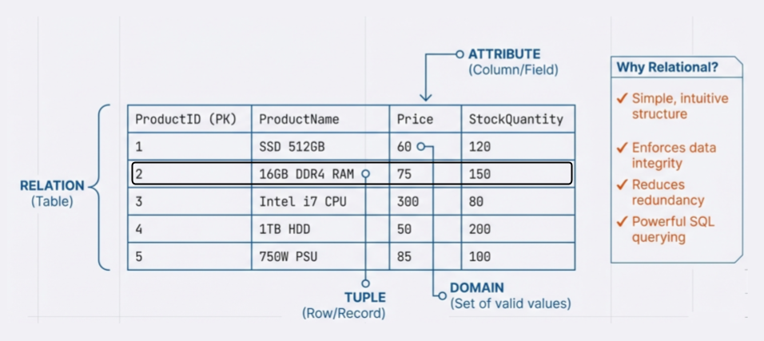
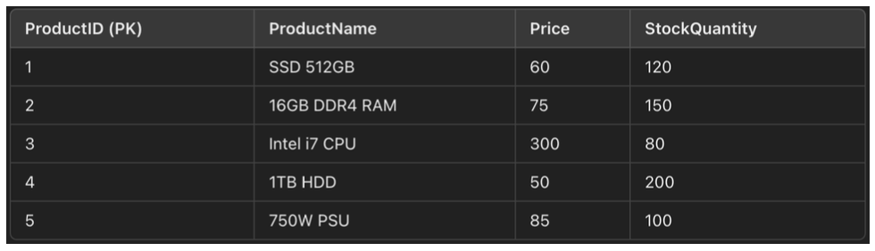
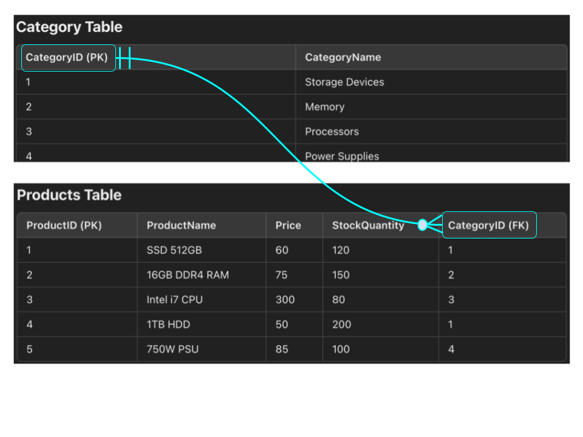
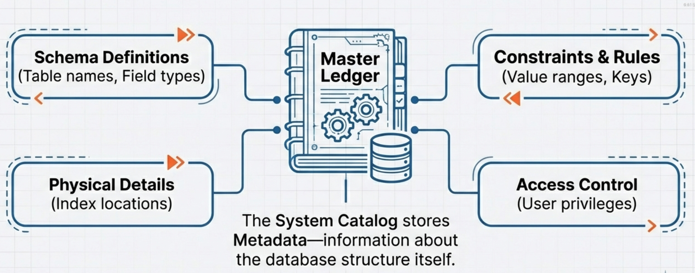
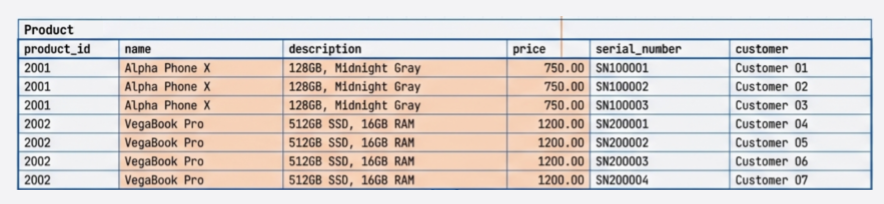
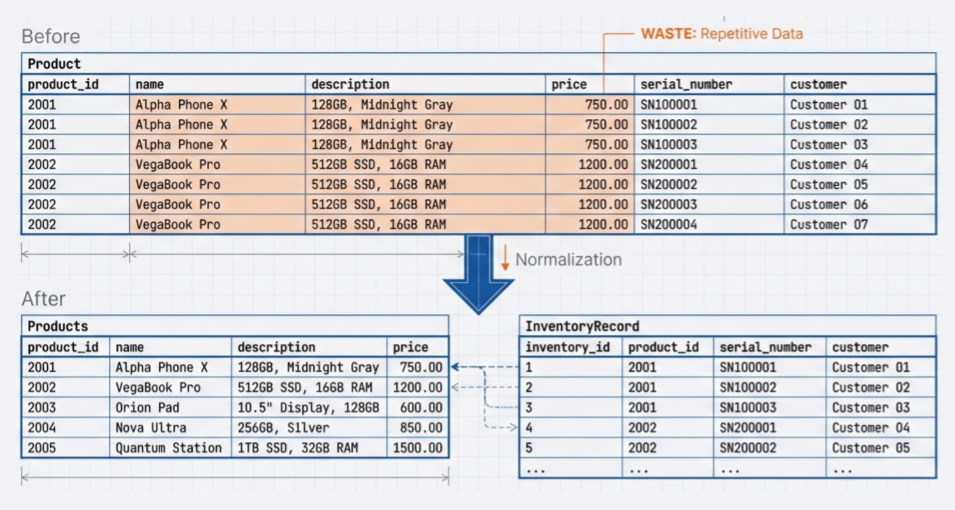

# Module 3: Relational Database Model

<!-- TOC -->
* [Module 3: Relational Database Model](#module-3-relational-database-model)
  * [1. Fundamentals of the Relational Model](#1-fundamentals-of-the-relational-model)
    * [Terminology](#terminology)
    * [Why Relational Model?](#why-relational-model)
  * [2. Table (Relation) Structure](#2-table-relation-structure)
    * [Components of a Table](#components-of-a-table)
  * [3. Integrity Rules (Constraints)](#3-integrity-rules-constraints)
    * [Primary Key (PK)](#primary-key-pk)
    * [Foreign Key (FK)](#foreign-key-fk)
    * [Unique Constraint](#unique-constraint)
    * [Not Null Constraint](#not-null-constraint)
    * [Check Constraint](#check-constraint)
    * [Validity Constraint](#validity-constraint)
    * [Referential Integrity and Foreign Keys](#referential-integrity-and-foreign-keys)
    * [Best Practices for Primary Keys](#best-practices-for-primary-keys)
  * [4. System Catalog and Metadata](#4-system-catalog-and-metadata)
    * [System Catalog](#system-catalog)
    * [Key Characteristics](#key-characteristics)
  * [Exercise1: E-Commerce System Design](#exercise1-e-commerce-system-design)
  * [Extension to Exercise 1: Tracking Individual Product Items](#extension-to-exercise-1-tracking-individual-product-items-)
    * [Refined Entity Definitions](#refined-entity-definitions)
    * [Define Relational Schemas](#define-relational-schemas)
<!-- TOC -->

---

## 1. Fundamentals of the Relational Model

The **relational model** organizes data into **tables (relations)** consisting of **rows (tuples)** and **columns (attributes)**.  
It is based on solid mathematical foundations (set theory and predicate logic) and is the most widely used data model in database systems.

### Terminology

- **Relation**:  
  A table composed of rows and columns.

- **Tuple**:  
  A single row in a table representing one record.

- **Attribute**:  
  A column in a table representing a specific data field.

- **Domain**:  
  The set of valid values that an attribute can take (e.g., integers, dates, predefined ranges).

- **Relational Schema**:  
  Describes the structure of a table, including:
    - Attribute names
    - Data types
    - Primary Key (PK)
    - Foreign Keys (FK)

  **Example: Product Table Relational Schema**

    **Product**

    - `ProductID` : `INT`, **PRIMARY KEY**  
    Unique identifier for each product.
    - `ProductName` : `VARCHAR(255)`, **NOT NULL**  
      Name of the product.
    - `Price` : `DECIMAL(10,2)`, **NOT NULL**  
      Cost of the product.
    - `StockQuantity` : `INT`, **NOT NULL**  
      Number of units available in stock.

  **Textual Notation for Relational Schema**
    
  Product(
    ProductID int PK,
    ProductName String,
    Price double,
    StockQuantity int,
    CategoryID int FK → Category(CategoryID)
    )

### Why Relational Model?

- Simple and intuitive table-based structure
- Strong support for **data integrity** and **consistency**
- Reduced data redundancy through normalization
- Powerful and standardized querying using **SQL**

---

## 2. Table (Relation) Structure

A table is the fundamental storage structure in a relational database.

### Components of a Table

- **Table Name**  
  A unique identifier for the table.

- **Columns (Attributes)**  
  Define the data fields (e.g., `StudentID`, `Name`, `Age`).

- **Rows (Tuples)**  
  Represent individual records.

**Example: Product Table**

- `ProductID` (**Primary Key**): Unique identifier for each product
- `ProductName`: Name of the product
- `Price`: Cost of the product
- `StockQuantity`: Quantity available in stock

**Product**

---

## 3. Integrity Rules (Constraints)

**Integrity constraints** ensure data accuracy, consistency, completeness, and validity within a database.

* Accuracy – Ensures that data is correct, free from errors, and reflects real-world values.
* Consistency – Ensures that data remains uniform across the database (e.g., no conflicting information between tables).
* Completeness – Ensures that all required data is present and not missing.
* Validity - Ensures that data values are acceptable in type, format, and range.

---

### Primary Key (PK)

- Uniquely identifies each row in a table
- Cannot contain `NULL` values
- Must be unique
- Enforces **entity integrity**
- Examples:
  - `ProductID` in the **Product** table
  - `StudentID` in the **Student** table

---

### Foreign Key (FK)

- Establishes a relationship between two tables
- Enforces **referential integrity**
- Ensures that referenced data exists in the parent table
- Prevents orphan records
- Examples:
  - `Order.CustomerID` → **Customer(CustomerID)**
  - `Enrollment.StudentID` → **Student(StudentID)**

---

### Unique Constraint

- Ensures all values in a column (or set of columns) are unique
- Prevents duplicate entries
- Examples:
  - `Email` in a **User** table
  - `Username` in a **User** table

---

### Not Null Constraint

- Ensures that a column cannot contain `NULL` values
- Enforces **data completeness**
- Examples:
  - `Name` in a **Course** table
  - `OrderDate` in an **Order** table

---

### Check Constraint

- Ensures that column values satisfy a specific condition
- Enforces **data validity**
- Examples:
  - `Age >= 18`
  - `Price > 0`
  - `Rating BETWEEN 1 AND 5`
  - `Status IN ('Pending', 'Shipped', 'Delivered')`

---

### Validity Constraint

- Validity ensures that data values are acceptable in type, format, and range.
- Typically enforced using:
  - `CHECK` constraints
  - Data types
  - Controlled value lists
- Examples:
  - `Email` must follow a valid email format
  - `GraduationYear <= CURRENT_YEAR`
  - `Quantity >= 0`
  - INT column allows values approximately in the range **−2,147,483,648 to 2,147,483,647**

Together, these constraints ensure that the database remains **accurate**, **consistent**, **complete**, and **reliable**.

---

### Referential Integrity and Foreign Keys

**Referential integrity** ensures that relationships between tables remain consistent.

- `CategoryID` in the **Products** table is a **Foreign Key** referencing  
  `CategoryID` in the **Category** table.

This means:
- Every value in `Products.CategoryID` must exist in `Category.CategoryID`
- The foreign key value may be `NULL` (if allowed)

**Example Instance**
- Product: *SSD 512GB*
- `CategoryID = 1` → corresponds to *Storage Devices* in the **Category** table

**What Happens Without Referential Integrity?**

1. **Inserting Invalid Data**
  - Attempting to insert a product with `CategoryID = 5` fails if no such category exists.

2. **Deleting Referenced Data**
  - Deleting the *Storage Devices* category is prevented if products still reference it.

>**Best Practice**
>
>Always define **foreign keys** to:
>- Prevent orphaned records
>- Maintain consistency
>- Improve data reliability

---

### Best Practices for Primary Keys

- Keep primary keys **compact and simple** to improve performance (searching, constraint enforcement).
- Prefer integer-based keys.

  *Example:*  
  Use `ProductID = 1` instead of `ProductCode = 'SSD512GB'`.

- Avoid using meaningful or descriptive data (e.g., names) as primary keys.
- Ensure primary keys are **immutable** (do not change over time).
- Avoid sensitive business data (e.g., SSN) to protect privacy.
- Prefer **surrogate keys** (auto-incremented integers) over **natural keys**
  (e.g., SSN, StudentNumber).

---

## 4. System Catalog and Metadata

### System Catalog

The **system catalog** is a collection of internal tables that store **metadata** (data about data).

It contains information about:
- Tables and columns
- Data types and domains
- Primary and foreign keys
- Indexes
- Constraints
- Users and privileges

### Key Characteristics

- Managed automatically by the DBMS
- Essential for query optimization and integrity enforcement
- Users typically have **read-only access**, depending on privileges

---

## Exercise1: E-Commerce System Design

**From Business Rules to ER Model and Relational Model**

---

**Objective**

In this exercise, **database modeling is demonstrated** by converting **business rules** into an **Entity–Relationship (ER) model** using **Crow’s Foot notation**, followed by preparation for constructing a **relational model**.

---

**Task 1: Analysis of Business Rules**

Below are the business rules describing the structure and constraints of an **e-commerce database**. These rules are **analyzed** to identify the required **entities**, **attributes**, and **relationships**.

---

**Business Rules**

1. A **Customer** is allowed to place **many Orders**, while each **Order** is placed by **exactly one Customer**.

2. Each **Customer** is identified by a **unique Customer ID** and is associated with a **Name**, **Email**, **Phone Number**, and **Shipping Address**.

3. Each **Order** is identified by a **unique Order ID** and includes an **Order Date**, **Total Amount**, and **Status**  
   (e.g., pending, shipped, delivered).

4. An **Order** may contain **multiple Products**, and a **Product** may appear in **multiple Orders**.  
   The **quantity of each product within an order** is recorded.

5. Each **Product** is identified by a **unique Product ID** and includes a **Name**, **Description**, **Price**, and **Stock Quantity**.

6. A **Product** is associated with **one or more Categories**, and each **Category** may contain **multiple Products**.

7. **Payments** made by customers are tracked.  
   Each **Payment** is associated with **one Order**, and each **Order** is associated with **only one Payment**.

8. Each **Payment** is identified by a **unique Payment ID** and includes a **Payment Date**, **Amount Paid**, and **Payment Method**  
   (e.g., credit card, PayPal).

9. An **Order** may be associated with **one or more Shipments**, while each **Shipment** is associated with **exactly one Order**.

10. **Reviews** may be submitted by **Customers** for **Products**.  
    Each **Review** is associated with **one Customer** and **one Product**.

11. Each **Review** is identified by a **unique Review ID** and includes a **Rating** (1 to 5), **Review Text**, and **Review Date**.

---

**Task 2: Conversion of Business Rules into an ER Model**

Using **Crow’s Foot notation**, an **ER model** is constructed to represent the above business rules.

The ER model includes:

- **Entities** and their **attributes**
- **Relationships** between entities
- **Relationship types (cardinalities)**:
  - One-to-One (1:1)
  - One-to-Many (1:M)
  - Many-to-Many (M:N)

**Modeling Notes (Guidance)**

- **Associative entities** are used to resolve **many-to-many relationships** when additional attributes are required  
  (e.g., Order–Product with Quantity).
- **Mandatory and optional participation** is explicitly indicated where applicable.
- **Primary keys** and **foreign keys** are implied by the stated business rules.
- The resulting ER diagram is designed to support direct transformation into a **relational schema**.

---

**Task 3: Conversion of ER Model into an Relational (Logical) Model**

* Define relational schemas

## Extension to Exercise 1: Tracking Individual Product Items 

In the initial design of **Exercise 1**, a **Product** was modeled at the **type level**.  
That is, a product represented a general item (e.g., *Laptop*, *SSD*) without distinguishing
between individual physical units.

To represent **which products appear in an order** and **the quantity ordered**, a junction
table such as **OrderItem** is required. This table captures order-specific details:

- Order reference
- Product reference
- Quantity ordered
- PriceAtSale
- DiscountAtSale

While this is sufficient for many scenarios, it is **not adequate** for systems where
**individual product units** must be tracked.

---

**Why Product-Level Tracking Is Not Enough**

In realistic business scenarios—such as licensed software, electronic devices, subscriptions,
serialized goods, or warranty-based products—it is necessary to track **individual product units**
assigned to customers.

In real-world systems:

- Products exist as **individual physical units**
- Each unit may have a **unique identifier** (e.g., serial number, barcode)
- Customers receive a **specific unit**, not just a product type

---

**An Incorrect Design Approach (What Not to Do)**

One might attempt to store inventory-level details directly in the Product table:

Attempting to store inventory-level details directly in the **Product** table introduces
**repeating groups** and mixes product, inventory, and customer assignment data in a single structure.

This design leads to:

- **Data redundancy**, where product information is repeated
- **Insert anomalies**, where inventory cannot exist independently
- **Update anomalies**, where changes must be applied in multiple places
- **Delete anomalies**, where removing data may cause unintended loss of information

These issues compromise **data integrity** and waste storage space.

---

**Normalization as the Solution**

To eliminate redundancy and anomalies, the repeating structure is **decomposed** into
separate, well-defined entities:

- **Product** – stores product type information
- **ProductInventory(InventoryRecord)** – represents individual physical product units

This restructuring is part of the **normalization process**.

---

### Refined Entity Definitions

**ProductInventory**

A **ProductInventory** record represents a **single physical unit** of a product.

Each ProductInventory(InventoryRecord) item:
- Belongs to **one Product**
- Has a **unique identifier** (e.g., InventoryID or SerialNumber)
- May or may not be sold or assigned

**ProductInventory(InventoryRecord)**

| InventoryID | ProductID | SerialNumber | Status     |
|------------:|----------:|--------------|------------|
| 101         | 1         | SR001        | Available  |
| 102         | 1         | SR002        | Sold       |
| 201         | 2         | SR009        | Sold       |
| 202         | 2         | SR010        | Available  |

**Product**

| ProductID | Name             | UnitPrice |
|----------:|------------------|----------:|
| 1         | SSD 512GB        | 1000      |
| 2         | Laptop Pro 15    | 4000      |
| 3         | Wireless Mouse   | 150       |

---

**Association Between OrderItem and ProductInventory**

**OrderItem**

An **OrderItem** represents a product included in a specific order.

Each OrderItem:
- Belongs to **one Order**
- Refers to **one Product**
- Stores sale-specific details (e.g., quantity, price at sale, discount)

**OrderItem**

| OrderItemID | OrderID | ProductID | Quantity | PriceAtSale |
|------------:|--------:|----------:|---------:|------------:|
| 1           | 5001    | 1         | 2        | 950         |
| 2           | 5001    | 2         | 1        | 3800        |

This entity resolves the **many-to-many** relationship between **Order** and **Product**.

To track **which exact inventory units are sold**, an association is established between
**OrderItem** and **ProductInventory**.

The **OrderItem** entity acts as the correct **semantic bridge** between sales and inventory.

- An **OrderItem** may be associated with **one or more ProductInventory items**
- A **ProductInventory** item may be associated with **at most one OrderItem**
- Unsold inventory items remain unassociated

**Cardinality Summary**

- **OrderItem → ProductInventory**
  - Minimum: one (for fulfilled orders)
  - Maximum: many

- **ProductInventory → OrderItem**
  - Minimum: zero
  - Maximum: one

**ProductInventory**

| InventoryID | ProductID (FK) | OrderItemID (FK) | SerialNumber | Status     |
|------------:|----------------|------------------|--------------|------------|
| 101         | 1              | NULL             | SSD-SR-001   | Available  |
| 102         | 1              | 5001             | SSD-SR-002   | Sold       |
| 201         | 2              | 5002             | LAP-SR-009   | Sold       |
| 202         | 2              | NULL             | LAP-SR-010   | Available  |
| 301         | 3              | NULL             | MOU-SR-050   | Available  |

**Explanation**
- Each row represents **one physical product unit**
- `ProductID` links the unit to its product type
- `OrderItemID` links the unit to the order line it fulfills
- `NULL` indicates inventory items not yet sold
- `Status` reflects the current lifecycle state of the item

---

### Define Relational Schemas

