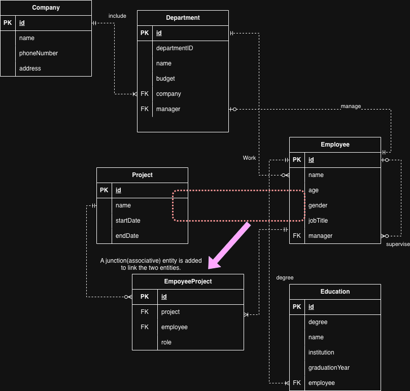
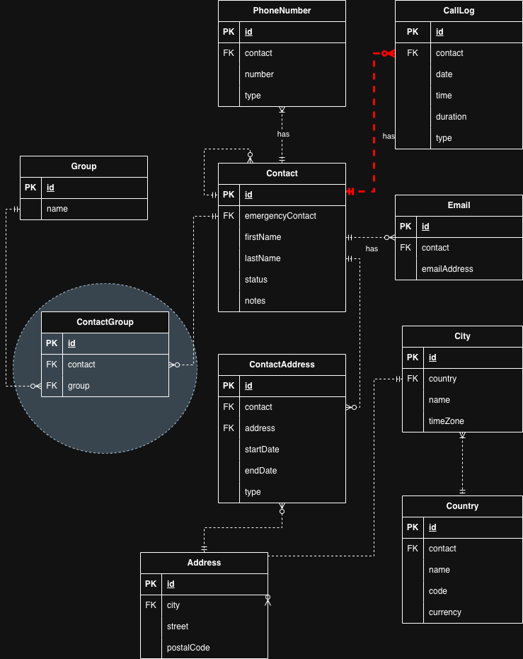

# Hands-on Exercise 1
## From ER Diagram to Relational Schema and Table Construction

### Objective

The objective of this exercise is to practice:

- Converting an **ER Diagram (Crow’s Foot notation)** into a **Relational Schema**
- Transforming the relational schema into actual **tables**
- Populating tables with valid sample data
- Identifying and emphasizing appropriate **constraints** (`PRIMARY KEY`, `FOREIGN KEY`, `NOT NULL`, `UNIQUE`)

Two ER diagrams are given below.

Students must analyze each diagram carefully and complete the required tasks.

**ER Diagram 1**

---

**ER Diagram 2**

---

## General Instructions

For **each ER Diagram**:

1. Identify:
    - Entities
    - Attributes
    - Primary Keys
    - Foreign Keys
    - Relationship types (1:1, 1:M, M:N)
    - Participation (mandatory / optional)

2. Convert the ER model into a **Relational Schema**.

3. Define appropriate constraints:
    - `PRIMARY KEY`
    - `FOREIGN KEY`
    - `NOT NULL`
    - `UNIQUE`
    - (Optional) `CHECK` constraints if logically required

4. Construct the corresponding tables using:
    - Google Sheets
    - Microsoft Excel
    - Or any similar tabular tool

5. Insert **at least 3 valid records into each table**.

6. Clearly indicate which fields:
    - Must be `NOT NULL`
    - Must be `UNIQUE`
    - Are optional (nullable)

---

# Task 1 – ER Diagram 1 → Relational Schema

### Step 1: Convert to Relational Schema

Write the relational schema using the following format:

EntityName(
Attribute1 DataType PK,
Attribute2 DataType NOT NULL,
Attribute3 DataType,
Attribute4 DataType UNIQUE,
ForeignKeyAttribute DataType NOT NULL FK → ReferencedTable(ReferencedPK)
)

Guidelines:

- Every entity must become a table.
- 1:M relationships must be implemented using a Foreign Key on the “many” side.
- M:N relationships must be resolved using a junction (associative) table.
- 1:1 relationships must be implemented carefully (choose appropriate side for FK).
- Unary (recursive) relationships must reference the same table.
- Mandatory participation → `NOT NULL` foreign key.
- Optional participation → nullable foreign key.

---

### Step 2: Construct Tables

Using Google Sheets, Excel, or similar:

- Use column names exactly as defined in the relational schema.
- Clearly mark:
    - Primary Keys
    - Foreign Keys
    - NOT NULL fields
    - UNIQUE fields

---

### Step 3: Insert Sample Data

For each table:

- Insert **at least 3 rows**.
- Ensure:
    - Primary keys are unique.
    - Foreign keys reference existing rows.
    - `NOT NULL` fields do not contain NULL.
    - `UNIQUE` fields contain no duplicate values.
    - Cardinality rules are respected.
    - Optional relationships may contain NULL where allowed.

---

# Task 2 – ER Diagram 2 → Relational Schema

Repeat the same process for the second ER diagram.

