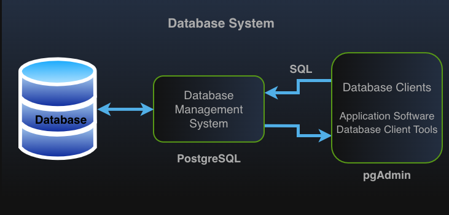
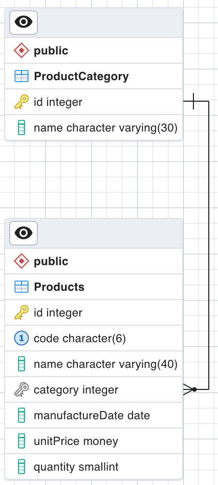

# **Module 4: Fundamentals of Structured Query Language (SQL)**


<!-- TOC -->
* [**Module 4: Fundamentals of Structured Query Language (SQL)**](#module-4-fundamentals-of-structured-query-language-sql)
  * [1. Introduction to Structured Query Language (SQL)](#1-introduction-to-structured-query-language-sql)
    * [**Setting Up the Working Environment**](#setting-up-the-working-environment)
    * [SQL Functions and Categories](#sql-functions-and-categories)
  * [2. Basic SQL Data Definition Language (DDL) Statements (CREATE, ALTER, DROP)](#2-basic-sql-data-definition-language-ddl-statements-create-alter-drop)
    * [CREATE](#create)
      * [CREATE DATABASE](#create-database)
      * [CREATE SCHEMA](#create-schema)
      * [CREATE TABLE](#create-table)
        * [Commonly Used SQL and PostgreSQL Data Types](#commonly-used-sql-and-postgresql-data-types)
        * [Best Practices for Choosing Data Types](#best-practices-for-choosing-data-types)
    * [ALTER](#alter)
    * [DROP](#drop)
    * [Defining Constraints in SQL](#defining-constraints-in-sql)
      * [NOT NULL Constraint](#not-null-constraint)
      * [DEFAULT Constraint](#default-constraint)
      * [UNIQUE Constraint](#unique-constraint)
      * [CHECK Constraint](#check-constraint)
      * [PRIMARY KEY Constraint](#primary-key-constraint)
      * [FOREIGN KEY Constraint](#foreign-key-constraint)
  * [3. Basic SQL DML Statements (SELECT, INSERT, UPDATE, DELETE)](#3-basic-sql-dml-statements-select-insert-update-delete)
    * [**SELECT**](#select)
    * [**WHERE**](#where)
    * [**DISTINCT**](#distinct)
    * [**ORDER BY**](#order-by)
    * [**LIKE / NOT LIKE**](#like--not-like)
    * [**BETWEEN**](#between)
    * [**IN**](#in)
    * [**Querying NULL and Non-NULL Values**](#querying-null-and-non-null-values)
    * [**AS (Alias for Columns and Tables) for Columns**](#as-alias-for-columns-and-tables-for-columns)
    * [**SQL JOIN Operations**](#sql-join-operations)
      * [**1. INNER JOIN**](#1-inner-join)
      * [**2. LEFT JOIN (LEFT OUTER JOIN)**](#2-left-join-left-outer-join)
      * [**3. RIGHT JOIN (RIGHT OUTER JOIN)**](#3-right-join-right-outer-join)
      * [**4. FULL JOIN (FULL OUTER JOIN)**](#4-full-join-full-outer-join)
      * [**Summary of Join Operations**](#summary-of-join-operations)
    * [**SELECT ... INTO**](#select--into)
    * [**INSERT**](#insert)
    * [**INSERT INTO ... SELECT**](#insert-into--select)
    * [**UPDATE**](#update)
    * [**DELETE**](#delete)
  * [4. Using a Programming Language to Interact With a Database](#4-using-a-programming-language-to-interact-with-a-database)
    * [Database Drivers – Core Functions](#database-drivers--core-functions)
    * [Database Operations with Java and PostgreSQL](#database-operations-with-java-and-postgresql)
      * [Example Workflow (Conceptual)](#example-workflow-conceptual)
<!-- TOC -->


## 1. Introduction to Structured Query Language (SQL)

SQL is the standard language for managing and querying relational databases.

SQL is used to interact with relational database management systems (RDBMS).

**Efficient use of SQL improves database performance, optimizes queries, and ensures data integrity.**




### **Setting Up the Working Environment**

To work with SQL databases efficiently, a proper working environment is required.

**Installing PostgreSQL**
PostgreSQL is an open-source and powerful relational database management system.
- **Download Link**: [Download PostgreSQL](https://www.postgresql.org/download)
- Supports Windows, macOS, and Linux.
- Complies with SQL standards and offers extensive plugin support.

**Installing pgAdmin**
pgAdmin is the most commonly used graphical management tool for PostgreSQL.
- It is distributed along with PostgreSQL.
- Provides a user-friendly interface for managing databases, executing queries, and visualizing schemas.


**Importing and Exporting Sample Databases**

* **Northwind Sample Database**
  - A well-known example database that simulates a trading company's operations.
  - Can be imported using **pgAdmin**.
  - [Download](../resources/dbs/northwind.backup)

* **Pagila Sample Database**
  - A PostgreSQL-specific sample database inspired by Sakila (used in MySQL).
  - Contains data related to a fictional DVD rental store.
  - Can be imported using **pgAdmin**.
  - [Download](../resources/dbs/pagila.backup)


**Define a new role**

The following credentials will be used for all database-related operations throughout the course.

username: lectureuser
password: lecturepassword

```sql
CREATE ROLE lectureuser WITH 
  LOGIN 
  PASSWORD 'lecturepassword'
  SUPERUSER 
  CREATEDB 
  CREATEROLE;
```

---

### SQL Functions and Categories

SQL functions can be divided into two main categories:

**1. Data Definition Language (DDL)** – Structural Commands
DDL includes commands that define and modify database structures:
- Defining, altering, and deleting database objects such as **database, table, view, function, etc.**.

**2. Data Manipulation Language (DML)** – Data Processing Commands
DML includes commands that manipulate data within tables:
- Inserting, deleting, updating, and retrieving(querying) **data**.


---

## 2. Basic SQL Data Definition Language (DDL) Statements (CREATE, ALTER, DROP)

Used to define, modify, and remove database objects such as databases, tables, views, etc.

---
**Data integrity constraints are enforced when DDL statements are executed. If a data integrity violation occurs,
the operation is aborted, ensuring that data remains consistent and accurate.**
---

### CREATE

This statement is used to define and initialize various database objects, including databases,
schemas, tables, views, indexes, stored procedures, functions, etc.
It establishes the structure and properties of these objects within the database.

#### CREATE DATABASE

Constructs a new database.

```sql
CREATE DATABASE ecommercedb
  ENCODING='UTF-8' -- Specifies UTF-8 character encoding for supporting Kazakh characters.
  
  LC_COLLATE='kk_KZ.UTF-8' -- Defines Kazakh-specific sorting and comparison rules.
  --Affects ORDER BY, LIKE, ILIKE, and index behavior.
  
  LC_CTYPE='kk_KZ.UTF-8' -- Sets Kazakh-specific character classification and case conversion.
  -- Affects case conversions (UPPER(), LOWER()), character classification (ISALPHA(), ISDIGIT()), and regular expressions.

  OWNER postgres -- Assigns the database owner to the postgres user.
  TEMPLATE=template0; -- Creates a clean database without default template settings.
```

#### CREATE SCHEMA

A schema logically divides a database into sections, similar to a folder structure on a hard disk.

Facilitates database management, multi-user collaboration on the same project (namespace management), and ensuring security.

```sql
CREATE SCHEMA schema1;

```

#### CREATE TABLE

Used to define a table.

When constructing a table, data types of each column must be specified.

For the list of PostgreSQL data types:
[PostgreSQL Data Types](https://www.postgresql.org/docs/10/static/datatype.html)

Choosing appropriate data types for columns is crucial because:

* It improves performance and optimizes resource utilization.
  * Choose the smallest possible data type for each column to save space and boost performance.
* It ensures data consistency and accuracy (validation).
  * If we choose **INT** for the quantity field, sending a string is impossible.
* It provides protection against certain types of security attacks.
  * If we use a **JSON** type instead of **TEXT**, data that doesn't follow the JSON format cannot be stored.
  * This prevents the storage of potentially harmful scripts like `"<script>..."`, thereby mitigating the risk of stored XSS attacks.


##### Commonly Used SQL and PostgreSQL Data Types

- **Numeric Types**:
  - `SMALLINT`, `INTEGER`, and `BIGINT` store whole numbers (integers) without fractional parts.
  - `DECIMAL` and `NUMERIC` store exact decimal values with user-defined precision.
  - `REAL` and `DOUBLE PRECISION` store floating-point numbers with approximate precision.

- **String Types**:
  - `CHAR(n)` / `CHARACTER(n)` and `VARCHAR(n)` / `CHARACTER VARYING(n)` store fixed-length and variable-length character strings, respectively.
  - `TEXT` stores variable-length character data without a length limit (PostgreSQL-specific).

- **Bit String Types**:
  - `BIT(n)` stores fixed-length bit strings.
  - `BIT VARYING(n)` stores variable-length bit strings.

- **Date/Time Types**:
  - `DATE` stores calendar dates (year, month, day).
  - `TIME [(p)] [WITH | WITHOUT TIME ZONE]` stores time of day (hours, minutes, seconds, optional fractional seconds).
  - `TIMESTAMP [(p)] [WITH | WITHOUT TIME ZONE]` stores both date and time values.
  - `INTERVAL` stores time spans (e.g., days, hours, minutes).

- **Boolean Type**:
  - `BOOLEAN` stores `TRUE`, `FALSE`, or `NULL`.

- **SERIALs** (PostgreSQL-specific)
  - The data types SMALLSERIAL, SERIAL, and BIGSERIAL are not true types but shorthand for defining integer
    columns with auto-incrementing values, commonly used for unique identifiers.

##### Best Practices for Choosing Data Types

- **Use the smallest suitable type** to optimize storage and performance (e.g., `SMALLINT` instead of `INTEGER` if values fit).
- **Prefer `NUMERIC` or `DECIMAL`** for exact precision in financial and monetary data.
- **Use `TEXT` sparingly**; prefer `VARCHAR(n)` if a reasonable length limit is known.
- **Choose `TIMESTAMP WITH TIME ZONE`** for time-sensitive applications to avoid timezone issues.
- **Use `BOOLEAN`** instead of small integer flags for true/false values, as it improves readability,
  enforces stricter validation, and prevents unintended values (e.g., `2` or `-1`).
- **Avoid `DOUBLE PRECISION`** for exact calculations due to floating-point precision errors.
- **Use `BIT` types** only when working with binary data or flags requiring bitwise operations.


```sql
CREATE TABLE products ( 
    id SERIAL,
    code CHAR(6) NOT NULL,
    name VARCHAR(40) NOT NULL,
    date DATE DEFAULT '2019-01-01',
    price MONEY,
    quantity SMALLINT DEFAULT 0,
    CONSTRAINT "productsPK" PRIMARY KEY(id),
    CONSTRAINT "productsUnique" UNIQUE(code),
    CONSTRAINT "productsCheck" CHECK(quantity >= 0)
);

```

* Adding a new product

```sql
INSERT INTO products
(code,name, price, date, quantity) VALUES
    ('ELO001','TV', 1300, '2019-10-30', 5);
```


### ALTER

The `ALTER` statement is used to modify the structure of existing database objects, such as tables, schemas, constraints, etc.
It allows adding, deleting, or modifying columns, constraints, and other properties without affecting the stored data.

* Add a new column
```sql
ALTER TABLE products ADD COLUMN "manufacturingCountry" VARCHAR(30);
```

* Modify an existing column
```sql
ALTER TABLE products ALTER COLUMN "manufacturingCountry" TYPE CHAR(20);
```

* Remove an existing column from a table
```sql
ALTER TABLE products DROP COLUMN "manufacturingCountry";

```


### DROP
The `DROP` statement is used to permanently remove database objects such as tables, schemas, views, indexes, etc.
Once an object is dropped, all associated data and dependencies are lost and cannot be recovered unless a backup exists.

```sql

DROP TABLE products;

DROP SCHEMA schema1;

DROP DATABASE ecommercedb;

```


### Defining Constraints in SQL

SQL constraints help maintain data integrity by enforcing rules on table columns.

The following table structure will be utilized throughout the constraints section.
```sql
CREATE TABLE products (
    id SERIAL,
    code CHAR(6) NOT NULL,
    name VARCHAR(40) NOT NULL,
    date DATE DEFAULT '2019-01-01',
    price MONEY,
    quantity SMALLINT DEFAULT 0,
    CONSTRAINT "productsPK" PRIMARY KEY(id),
    CONSTRAINT "productsUnique" UNIQUE(code),
    CONSTRAINT "productsCheck" CHECK(quantity >= 0)
);
```

#### NOT NULL Constraint

- Ensures that a column cannot contain NULL values.
- Data must be provided for the column when inserting/updating a record.

If no value is provided for the `code` column, an error occurs.

```sql
INSERT INTO products
(name, price, date, quantity) VALUES
('TV', 1300, '2019-10-30', 5);

```


To remove the NOT NULL constraint from the `code` column:
```sql
ALTER TABLE products ALTER COLUMN code DROP NOT NULL;

```
To add the NOT NULL constraint to the `code` column:

```sql
ALTER TABLE products ALTER COLUMN code SET NOT NULL;

```


#### DEFAULT Constraint

- Assigns a default value to a column when no value is provided during an insert operation.

```sql
INSERT INTO products
(code, name, price, quantity) VALUES
('ELO004', 'TV', 1300, 5);

```

- If no value is provided for date, '2019-01-01' is assigned.

To remove the DEFAULT constraint from the `date` column:
```sql
ALTER TABLE products ALTER COLUMN date DROP DEFAULT;

```

To add the DEFAULT constraint to the `date` column:
```sql
ALTER TABLE products ALTER COLUMN date SET DEFAULT '2019-01-01';

```


#### UNIQUE Constraint

- Ensures that all values in a column (or combination of columns) are unique across the table.


- The `code` column must contain unique values.
```sql
INSERT INTO products
(code,name, price, date, quantity) VALUES
('ELO001','TV', 1300, '2019-10-30', 5);
```


To remove the UNIQUE constraint from the `code` column:

```sql
ALTER TABLE products DROP CONSTRAINT "productsUnique";
```


To add the UNIQUE constraint to the `code` column:

```sql
ALTER TABLE products ADD CONSTRAINT "productsUnique" UNIQUE (code);
```

**Multi-Column UNIQUE Constraint**
- Ensures that a combination of `code` and `name` is unique across the table.
```sql
ALTER TABLE products ADD CONSTRAINT "productsUnique" UNIQUE ("code,name");
```


#### CHECK Constraint

- Restricts the values allowed in a column based on a specific condition.


```sql
CREATE TABLE products (
    id SERIAL,
    code CHAR(6) NOT NULL,
    name VARCHAR(40) NOT NULL,
    date DATE DEFAULT '2019-01-01',
    price MONEY,
    quantity SMALLINT DEFAULT 0,
    CONSTRAINT "productsPK" PRIMARY KEY(id),
    CONSTRAINT "productsUnique" UNIQUE(code),
    CONSTRAINT "productsCheck" CHECK(quantity >= 0)
);
```

- Ensures that `quantity` is always greater than or equal to zero.

- If an attempt is made to insert a record where `quantity` is `-3`, it will fail due to the CHECK constraint.
```sql
INSERT INTO products
(code, name, price, date, quantity) VALUES
('ELO004', 'Computer', 1300, '2016-04-05', -3);

```

To remove the CHECK constraint on the `quantity` column:
```sql
ALTER TABLE products DROP CONSTRAINT "productsCheck";

```
To add the CHECK constraint back to the `quantity` column:

```sql
ALTER TABLE products ADD CONSTRAINT "productsCheck" CHECK (quantity >= 0);

```


#### PRIMARY KEY Constraint

- Uniquely identifies each record in a table.
- A table can have only one primary key, which can consist of a single column or multiple columns.

```sql
CREATE TABLE products (
    id SERIAL,
    code CHAR(6) NOT NULL,
    name VARCHAR(40) NOT NULL,
    date DATE DEFAULT '2019-01-01',
    price MONEY,
    quantity SMALLINT DEFAULT 0,
    CONSTRAINT "productsPK" PRIMARY KEY(id),
    CONSTRAINT "productsUnique" UNIQUE(code),
    CONSTRAINT "productsCheck" CHECK(quantity >= 0)
);
```


- `id` is the primary key of the `products` table.

To remove the PRIMARY KEY constraint from the `id` column:

```sql
ALTER TABLE products DROP CONSTRAINT "productsPK";

```

To add the PRIMARY KEY constraint  to the `id` column:

```sql
ALTER TABLE products ADD CONSTRAINT "productsPK" PRIMARY KEY(id);

```

**Composite PRIMARY KEY**
- A primary key defined using multiple columns (e.g., `id` and `code` together form the primary key).

```sql
ALTER TABLE products ADD CONSTRAINT "productsPK" PRIMARY KEY(id,code);

```


#### FOREIGN KEY Constraint

- Establishes a relationship between two tables by linking a foreign key column in one table to a primary key in another table.
- Helps enforce referential integrity.

---
**The data types of Foreign Key (FK) and Primary Key (PK) fields must be compatible to establish a relationship.**

---

* **Example**



| id   | ProductName | CategoryID | M<------->1 | id | CategoryName    |
|-----|------------|--------------|-------------|----|--|
| 101 | Coffee     | 1            |             | 1  | Beverages      |
| 102 | Tea        | 1            |             | 2  | Condiments     |
| 103 | Mustard    | 2            |             | 3  | Dairy Products |
| 104 | Cheese     | 3            |             | 4  | Electronics |  
| 105 | Yogurt     | 3            |             |
| 106 | Honey           | NULL     |             |


```sql
CREATE TABLE "ProductCategories" (
    id SERIAL,
    name VARCHAR(30) NOT NULL,
    CONSTRAINT "productCategoryPK" PRIMARY KEY(id)
);

```

```sql
CREATE TABLE products (
    "id" SERIAL,
    code CHAR(6) NOT NULL,
    name VARCHAR(40) NOT NULL,
    "category" INTEGER NOT NULL, 
    date DATE DEFAULT '2019-01-01',
    price MONEY,
    quantity SMALLINT DEFAULT 0,
    CONSTRAINT "productsPK" PRIMARY KEY("id"),
    CONSTRAINT "productsUnique" UNIQUE(code),
    CONSTRAINT "productsCheck" CHECK(quantity >= 0),
    CONSTRAINT "productCategoryFK" FOREIGN KEY("category") REFERENCES "ProductCategories"(id)
);

```


- The `"category"` column in the `products` table references the `"id"` column in the `"ProductCategories"` table.

By default, `ON DELETE` and `ON UPDATE` actions are adjusted as `NO ACTION`.

* Different Foreign Key Behaviors

  - **NO ACTION (default):** Prevents deletion or update of a referenced record if related records exist.
  - **RESTRICT:** Similar to `NO ACTION`, explicitly prevents the operation.
  - **CASCADE:** Automatically deletes or updates child records when the parent record is deleted or updated.
  - **SET NULL:** Sets the foreign key column to `NULL` when the referenced record is deleted.
  - **SET DEFAULT:** Sets the foreign key column to its default value when the referenced record is deleted.

To remove the FOREIGN KEY constraint from the `"category"` column:
```sql
ALTER TABLE products DROP CONSTRAINT "productCategoryFK";

```

To add the FOREIGN KEY constraint with `NO ACTION` behavior:

```sql
ALTER TABLE products
ADD CONSTRAINT "productCategoryFK" FOREIGN KEY("category") REFERENCES "ProductCategories"("id") ON DELETE NO ACTION ON UPDATE NO ACTION;

```


To add the FOREIGN KEY constraint with `CASCADE` behavior:


```sql
ALTER TABLE products
ADD CONSTRAINT "productCategoryFK" FOREIGN KEY("category") REFERENCES "ProductCategories"("id") ON DELETE CASCADE ON UPDATE CASCADE;

```

---


## 3. Basic SQL DML Statements (SELECT, INSERT, UPDATE, DELETE)

| Command  | Description |
|----------|------------|
| **SELECT** | Retrieves data from one or more tables. |
| **INSERT** | Adds new data into a table. |
| **UPDATE** | Modifies existing records in a table. |
| **DELETE** | Removes specific data from a table. |


---
**The following queries are based on the Northwind sample database.**

---

### **SELECT**
The **SELECT** statement is used to retrieve data from the database (searching/listing).

```sql
SET search_path TO schema,public;

SELECT * FROM "customers";

SELECT "CompanyName", "ContactName" FROM "customers";
```

### **WHERE**

The WHERE clause is used to filter records based on specified conditions, returning only the rows that meet the query condition.

```sql
SELECT * FROM "customers" WHERE "Country" = 'Argentina';

SELECT * FROM "customers" WHERE "Country" != 'Brazil';

SELECT * FROM "customers" WHERE "Country"='Brazil' AND "Region" = 'SP';

SELECT * FROM "customers" WHERE "Country" = 'Türkiye' OR "Country" = 'Japan';

SELECT * FROM "customers" WHERE "Country" = 'Kazakhstan' or "Country"='Russia';

SELECT * FROM "order_details" WHERE price = 14;

SELECT * FROM "order_details" WHERE price < 14;

SELECT * FROM "order_details" WHERE price <= 14;

SELECT * FROM "order_details" WHERE price >= 14;

SELECT * FROM "order_details" WHERE price > 14;
```

### **DISTINCT**

The **DISTINCT** keyword is used to eliminate duplicate rows from the query results, ensuring that only unique records are retrieved.


```sql
SELECT DISTINCT "City" FROM "customers";
-- Retrieves a list of unique city names from the customers table.
-- If multiple customers are from the same city, only one entry per city appears in the result.

SELECT DISTINCT "OrderID", "Discount" FROM "order_details" ORDER BY "OrderID";
--Retrieves unique combinations of OrderID and Discount values from the order_details table.
```

### **ORDER BY**

The **ORDER BY** clause is used to sort the query results in either **ascending (ASC)** or **descending (DESC)** order 
based on one or more columns. Sorting can be applied to both **alphabetic (text)** and **numeric** values.

**Sorting in Ascending Order (Default Behavior)**
```sql
SELECT * FROM "customers" ORDER BY "ContactName" ASC;
--Retrieves all records from the customers table.
--Sorts the results by ContactName in ascending (A → Z) order.
--The ASC keyword is optional because ascending order is the default sorting behavior.

SELECT * FROM "customers" ORDER BY "ContactName" DESC;

SELECT * FROM "customers" ORDER BY "ContactName" DESC, "CompanyName";
--Sorts the results by ContactName in descending order.
--If multiple records have the same ContactName, they are sorted by CompanyName in ascending (default) order.

SELECT * FROM "customers" ORDER BY "Country", "ContactName";
```

### **LIKE / NOT LIKE**

The **LIKE** and **NOT LIKE** operators are used with the **WHERE** clause to filter records based on a specified pattern. 
These operators are particularly useful for searching text data in a flexible manner.

- **LIKE**: Returns records that match the specified pattern.
- **NOT LIKE**: Returns records that do not match the specified pattern (excludes `NULL` values).
- **Wildcard Characters**:
    - `%` : Represents **zero or more** characters. It stands for any sequence of characters (including an empty sequence).
    - `_` : Represents **exactly one** character. It stands for a single character, which can be any value.

* **Examples:**


```sql
SELECT * FROM "customers" WHERE "Country" LIKE 'P%';
--Retrieves all records where the Country name starts with 'P'.

SELECT * FROM "customers" WHERE "Country" NOT LIKE 'P%';
--Retrieves all records where the Country name does not start with 'P'.
--NULL values are not included in the results.

SELECT * FROM "customers" WHERE "Country" LIKE '%e';
--Retrieves all records where the Country name ends with 'e'.

SELECT * FROM "customers" WHERE "Country" LIKE '_a%';
--The underscore _ ensures that the first character can be anything, but the second character must be 'a'.

SELECT * FROM "customers" WHERE "Country" LIKE '%pa%';
--Retrieves all records where the Country name contains 'pa' anywhere.
```

### **BETWEEN**

The **BETWEEN** operator is used in the **WHERE** clause to filter records within a specified range. 
It works with **numeric, date, and text values**.

- **BETWEEN X AND Y**: Includes values **greater than or equal to X** and **less than or equal to Y**.
- Can be used with **numbers, dates, and text values**.
- The **range boundaries are inclusive**.

```sql
SELECT * FROM products WHERE price BETWEEN 10 AND 20;
--Find all products with a unit price between 10 and 20

SELECT * FROM products WHERE "ProductName" BETWEEN 'C' AND 'M';
--Retrieves all products where ProductName starts with a letter from 'C' to 'M'.
--SQL evaluates text values based on alphabetical order.
--Example matches: 'Cheese', 'Honey', 'Juice', 'Milk', but not 'Apple' or 'Banana'.
```

### **IN**

The **IN** operator is used in the **WHERE** clause to filter records that match **any** value in a given list. 
It is an alternative to using multiple **OR** conditions.

```sql
SELECT * FROM "customers"  
WHERE "public"."customers"."Country" IN ('Argentina', 'Kazakhstan');
--Find all customers from Argentina or Kazakhstan
```

### **Querying NULL and Non-NULL Values**

In SQL, **NULL** represents missing or undefined data. A field containing **NULL** does not hold any value, including an empty string (`''`) or zero (`0`).

To check whether a column contains NULL or non-NULL values, the **IS NULL** and **IS NOT NULL** operators are used.


```sql
SELECT * FROM "customers" WHERE "Region" IS NOT NULL;
--Retrieves all records where the Region field contains a valid (non-NULL) value.

SELECT * FROM "customers" WHERE "Region" IS NULL;
--Retrieves all records where the Region field does not have a value (is NULL).
```

### **AS (Alias for Columns and Tables) for Columns**

The **AS** keyword is used to assign an **alias (temporary name)** to columns or tables in SQL queries. 
Aliases improve readability and make query results more user-friendly.

- **Column alias:** Renames a column in the result set.
- **Table alias:** Renames a table (often used in complex queries and joins).


* **Assign an alias to a column**

```sql
SELECT "CompanyName" AS "Customer Company" FROM "customers";
--Renames the CompanyName column as "Customer Company" in the query result.

SELECT price, price * 1.18 AS "Unit Price With Tax" FROM products;
--Retrieves the UnitPrice column.
--Calculates the price with 18% VAT and renames the result as "Unit Price With Tax".

SELECT "OrderID",
       "ShipPostalCode" || ',' || "ShipAddress" AS "Shipping Address"
FROM "orders"
WHERE "OrderDate" BETWEEN '07/04/1996' AND '07/09/1996';
--Concatenates ShipPostalCode and ShipAddress, separating them with a comma, and assigns the alias "Shipping Address".
--Filters orders where the OrderDate is between July 4, 1996, and July 9, 1996.
```

---

### **SQL JOIN Operations**


* **Categories Table**

| CategoryID | CategoryName    |
|------------|----------------|
| 1          | Beverages      |
| 2          | Condiments     |
| 3          | Dairy Products |
| 4          | Electronics |  

* **Products Table**

| ProductID | ProductName      | CategoryID |
|-----------|-----------------|------------|
| 101       | Coffee          | 1          |
| 102       | Tea             | 1          |
| 103       | Mustard         | 2          |
| 104       | Cheese          | 3          |
| 105       | Yogurt          | 3          |
| 106       | Honey           | NULL       |


#### **1. INNER JOIN**
Returns only the records that have matching values in both tables.
- Only products with a valid `CategoryID` in the **Categories** table are included.
- Any product with a `NULL` `CategoryID` is excluded.

```sql
SELECT Products.ProductID, Products.ProductName, Categories.CategoryName
FROM Products
INNER JOIN Categories ON Products.CategoryID = Categories.CategoryID;
```

* **Products and Categories Tables (Side by Side)**

| ProductID | ProductName | CategoryID | M<------->1 |CategoryID | CategoryName    |
|-----------|------------|--------------|-------------|--|--|
| 101       | Coffee     | 1            |             |1          | Beverages      |
| 102       | Tea        | 1            |             |2          | Condiments     |
| 103       | Mustard    | 2            |             |3          | Dairy Products |
| 104       | Cheese     | 3            |             | 4          | Electronics |  
| 105       | Yogurt     | 3            |             |
| 106       | Honey           | NULL     |             |


* **Result Table:**

| ProductID | ProductName | CategoryName    |
|-----------|------------|----------------|
| 101       | Coffee     | Beverages      |
| 102       | Tea        | Beverages      |
| 103       | Mustard    | Condiments     |
| 104       | Cheese     | Dairy Products |
| 105       | Yogurt     | Dairy Products |


```sql
SELECT 
  "public"."orders"."OrderID",
  "public"."customers"."CompanyName",
  "public"."customers"."ContactName",
  "public"."orders"."OrderDate"
FROM "orders" 
INNER JOIN "customers" ON "orders"."CustomerID" = "customers"."CustomerID" 
```

```sql
SELECT 
  "orders"."OrderID",
  "orders"."OrderDate",
  "customers"."CompanyName",
  "employees"."FirstName",
  "employees"."LastName"
FROM "orders"
INNER JOIN "customers" ON "orders"."CustomerID" = "customers"."CustomerID"
INNER JOIN "employees" ON "orders"."EmployeeID" = "employees"."EmployeeID";
```


#### **2. LEFT JOIN (LEFT OUTER JOIN)**
Returns all records from the **Products (left)** table, and matching records from the **Categories(right)** table.
- If a product does not have a matching category, `NULL` is returned for the category.
- Ensures all products are included in the result.

```sql
SELECT Products.ProductID, Products.ProductName, Categories.CategoryName
FROM Products
LEFT JOIN Categories ON Products.CategoryID = Categories.CategoryID;

```
* **Products and Categories Tables (Side by Side)**

| ProductID | ProductName | CategoryID | M<------->1 |CategoryID | CategoryName    |
|-----------|------------|--------------|----|--|--|
| 101       | Coffee     | 1            |    |1          | Beverages      |
| 102       | Tea        | 1            |    |2          | Condiments     |
| 103       | Mustard    | 2            |    |3          | Dairy Products |
| 104       | Cheese     | 3            |  | 4          | Electronics |  
| 105       | Yogurt     | 3            |  |
| 106       | Honey           | NULL     |             |

* **Result Table:**
* 
| ProductID | ProductName | CategoryName    |
|-----------|------------|----------------|
| 101       | Coffee     | Beverages      |
| 102       | Tea        | Beverages      |
| 103       | Mustard    | Condiments     |
| 104       | Cheese     | Dairy Products |
| 105       | Yogurt     | Dairy Products |
| 106       | Honey      | NULL           |

```sql
SELECT
  "orders"."OrderID",
  "customers"."CompanyName",
  "orders"."OrderDate"
FROM "customers"
LEFT JOIN "orders" ON "orders"."CustomerID" = "customers"."CustomerID" 
ORDER BY "OrderID" DESC;
```


#### **3. RIGHT JOIN (RIGHT OUTER JOIN)**
Returns all records from the **Categories** table, and matching records from the **Products** table.
- If a category does not have a matching product, `NULL` is returned for the product fields.
- Ensures all categories are included in the result.

```sql
SELECT Products.ProductID, Products.ProductName, Categories.CategoryName
FROM Products
RIGHT JOIN Categories ON Products.CategoryID = Categories.CategoryID;

```
* **Products and Categories Tables (Side by Side)**

| ProductID | ProductName | CategoryID | M<------->1 | CategoryID | CategoryName   |
|-----------|------------|--------------|----|------------|----------------|
| 101       | Coffee     | 1            |    | 1          | Beverages      |
| 102       | Tea        | 1            |    | 2          | Condiments     |
| 103       | Mustard    | 2            |    | 3          | Dairy Products |
| 104       | Cheese     | 3            |  | 4          | Electronics    |
| 105       | Yogurt     | 3            |  |
| 106       | Honey           | NULL     |             |

* **Result Table:**

| ProductID | ProductName | CategoryName   |
|-----------|-------------|----------------|
| 101       | Coffee      | Beverages      |
| 102       | Tea         | Beverages      |
| 103       | Mustard     | Condiments     |
| 104       | Cheese      | Dairy Products |
| 105       | Yogurt      | Dairy Products |
| NULL      | NULL        | Electronics    |

- If all categories have at least one associated product, the result is the same as **INNER JOIN**.
- If there is a category without any associated products(i.e. electronics), it appears in the table with `NULL` values in `ProductID` and `ProductName`.


```sql
SELECT
  "orders"."OrderID",
  "employees"."FirstName",
  "employees"."LastName",
  "orders"."OrderDate"
FROM "orders"
RIGHT OUTER JOIN "employees" ON "orders"."EmployeeID" = "employees"."EmployeeID" 
ORDER BY "OrderID" DESC;
```
```sql
INSERT INTO "employees" ("EmployeeID","FirstName", "LastName")
VALUES (10, 'Jack', 'Doe');
```
---

#### **4. FULL JOIN (FULL OUTER JOIN)**
Returns all records from both tables.
- If a product does not have a category, `NULL` appears in the `CategoryName`.
- If a category does not have any products, `NULL` appears in the `ProductID` and `ProductName`.

```sql
SELECT Products.ProductID, Products.ProductName, Categories.CategoryName
FROM Products
FULL JOIN Categories ON Products.CategoryID = Categories.CategoryID;

```

* **Products and Categories Tables (Side by Side)**

| ProductID | ProductName | CategoryID | M<------->1 |CategoryID | CategoryName    |
|-----------|------------|--------------|----|--|--|
| 101       | Coffee     | 1            |    |1          | Beverages      |
| 102       | Tea        | 1            |    |2          | Condiments     |
| 103       | Mustard    | 2            |    |3          | Dairy Products |
| 104       | Cheese     | 3            |  | 4          | Electronics    |
| 105       | Yogurt     | 3            |  |
| 106       | Honey           | NULL     |             |

* **Result Table:**

| ProductID | ProductName | CategoryName   |
|-----------|-------------|----------------|
| 101       | Coffee      | Beverages      |
| 102       | Tea         | Beverages      |
| 103       | Mustard     | Condiments     |
| 104       | Cheese      | Dairy Products |
| 105       | Yogurt      | Dairy Products |
| 106       | Honey       | NULL           |
| NULL      | NULL        | Electronics    |

- In this case, the result is similar to **LEFT JOIN** because all categories have products.
- If there were a category without products, it would appear in the table with `NULL` values in `ProductID` and `ProductName`.

---

#### **Summary of Join Operations**
- **INNER JOIN** → Only matching records from both tables.
- **LEFT JOIN** → All products, and matching categories (`NULL` for unmatched categories).
- **RIGHT JOIN** → All categories, and matching products (`NULL` for unmatched products).
- **FULL JOIN** → All records from both tables, `NULL` for missing matches.

Each **JOIN** type is used based on how we want to combine the data from different tables.  


### **SELECT ... INTO**

Used to copy data from an existing table into a **new table**.  
The new table **must not already exist** before executing the query.

**Example:**  
Copies the `CompanyName` and `ContactName` columns from the `customers` table into a new table named `Backup`.

**Note:** If `Backup` already exists, the operation will fail.

```sql
SELECT "CompanyName", "ContactName" INTO "Backup" FROM "customers";
```

---

### **INSERT**

---
**Data integrity constraints are enforced when insert, update, and delete statements are executed. If a data integrity violation occurs,
the operation is aborted, ensuring that data remains consistent and accurate.**
---

Add new records to a table.
- **Data integrity constraints** are enforced during the insertion process.
- It is possible to insert values into only specific columns.
- Columns that are not explicitly assigned a value will be set to **NULL** (empty).

* **Example 1: Inserting a Customer Record**

Inserts a new customer into the `customers` table.

```sql
INSERT INTO "customers" 
("CustomerID", "CompanyName", "ContactName", "Address", "City", "Country") 
VALUES ('X1', 'ABC', 'Jane', 'Address1', 'Astana', 'Kazakhstan');
```
```sql
INSERT INTO "public"."categories" ("CategoryID", "CategoryName", "Description") 
VALUES (9, 'Health', 'Health Products'),
       (10, 'Cleaning', 'Cleaning Products');
```

### **INSERT INTO ... SELECT**

Copies data from one table into another **existing table**.
- Unlike `SELECT ... INTO`, the target table **must exist** before executing the query.
- The number and types of columns in the `SELECT` statement must match the target table.
- **Data integrity constraints** are enforced during this operation.


```sql
INSERT INTO "Backup" SELECT "CompanyName", "ContactName" FROM "customers";

```

---

### **UPDATE**

The **UPDATE** statement is used to modify existing records in a table.
- **Data integrity constraints** are enforced during the update process.
- The `WHERE` clause is used to specify which records should be updated.
- If the `WHERE` clause is **not** included, **all rows** in the table are updated.


```sql
UPDATE "customers"
SET "ContactName" = 'Jane Lee',
    "City" = 'Astana'
WHERE "CustomerID" = '1';

```
---

### **DELETE**

The **DELETE** statement is used to remove one or more records from a table.
- **Data integrity constraints** are enforced during the deletion process.
- The `WHERE` clause specifies which records should be deleted.
- If the `WHERE` clause is **not** included, **all records** in the table are deleted.

* **Example 1: Deleting a Specific Record**

```sql
DELETE FROM "customers"
WHERE "CustomerID" = '1';
```

* **Example 2: Deleting All Records in a Table**

```sql
DELETE FROM "customers";
```

This query removes all records from the customers table without deleting the table itself.

**Warning: Omitting the WHERE clause will delete all records from the table. If you want to remove all records and reset identity values, consider using TRUNCATE TABLE instead.**


## 4. Using a Programming Language to Interact With a Database

Modern applications often need to store, retrieve, and manipulate data dynamically.
To perform these database operations from within an application, database drivers are essential.
These drivers act as a bridge between the programming language and the database management system (DBMS).

### Database Drivers – Core Functions
Database drivers typically provide the following core capabilities:
- **Establishing a connection** to the database.
- **Executing queries** (e.g., `SELECT`, `INSERT`, `UPDATE`, `DELETE`).
- **Retrieving results** and processing query outputs.
- **Managing transactions** to ensure data consistency.
- **Closing the connection** after operations are completed.


### Database Operations with Java and PostgreSQL

Java applications can seamlessly interact with PostgreSQL databases using **JDBC** (Java Database Connectivity).  
JDBC is a **standard API** that defines a set of interfaces and classes for connecting to relational databases,
sending SQL statements, and processing results.

It provides:
- **Connection management**
- **Statement execution**
- **Result retrieval**
- **Error handling and transaction control**

The **PostgreSQL JDBC driver** implements this API and allows Java programs to work directly with PostgreSQL databases.

You can download the PostgreSQL JDBC driver from [https://jdbc.postgresql.org/download/](https://jdbc.postgresql.org/download/)

or through maven with the following configuration:


`pom.xml`
```xml

<?xml version="1.0" encoding="UTF-8"?>
<project xmlns="http://maven.apache.org/POM/4.0.0"
         xmlns:xsi="http://www.w3.org/2001/XMLSchema-instance"
         xsi:schemaLocation="http://maven.apache.org/POM/4.0.0 http://maven.apache.org/xsd/maven-4.0.0.xsd">
    <modelVersion>4.0.0</modelVersion>

    <groupId>cc.ku</groupId>
    <artifactId>java-projects</artifactId>
    <version>1.0-SNAPSHOT</version>

    <properties>
        <maven.compiler.source>17</maven.compiler.source>
        <maven.compiler.target>17</maven.compiler.target>
        <project.build.sourceEncoding>UTF-8</project.build.sourceEncoding>
    </properties>

    <dependencies>
        <!-- postgresql -->
        <dependency>
            <groupId>org.postgresql</groupId>
            <artifactId>postgresql</artifactId>
            <version>42.7.8</version>
        </dependency>
        <!-- mongodb -->
        <dependency>
            <groupId>org.mongodb</groupId>
            <artifactId>mongodb-driver-bom</artifactId>
            <version>5.6.0</version>
            <type>pom</type>
        </dependency>
        <dependency>
            <groupId>org.mongodb</groupId>
            <artifactId>mongodb-driver-sync</artifactId>
            <version>5.6.0</version>
        </dependency>
      
    </dependencies>
</project>


```


#### Example Workflow (Conceptual)
1. **Load the driver**(library or JAR file - using maven or manual download ) in the project environment so that the Java application can
   communicate with the database.
2. **Establish a connection** to the PostgreSQL database using a connection string (URL(socket address), username, and password).
3. **Define and execute SQL statements**.
4. **Process the results** returned by the query.
5. **Close** the statement and connection to free resources.


**Code Example: A Java-based program for DB operations**


```java
/**Below is a Java program that demonstrates how to connect to a PostgreSQL database, execute a query, 
 * and retrieve data from the **customers** table.
 * Ensure that the JDK and PostgreSQL JDBC driver is properly installed and added to the classpath before running this program.
 * */
import java.sql.*;  // Database Driver

public class DatabaseOperationsWithJava {

  public static void main(String[] args)
  {
    try
    {
      /***** Establishing Connection *****/
      Connection conn = DriverManager.getConnection("jdbc:postgresql://localhost:5432/Northwind",
              "lectureuser", "lecturepassword");
      if (conn != null)
        System.out.println("Connected to the database!");
      else
        System.out.println("Connection attempt failed!");

      //String sql = "SELECT \"CustomerID\", \"CompanyName\", \"Country\" FROM \"customers\"";
      String sql = "SELECT * FROM customers";


      /***** Executing Query *****/
      Statement stmt = conn.createStatement();
      ResultSet rs = stmt.executeQuery(sql);

      /***** Closing Connection *****/
      conn.close();

      String customerID = null;
      String companyName = null;
      String country;

      while (rs.next())
      {
        /***** Assign field values to variables *****/
        customerID  = rs.getString("CustomerID");
        companyName = rs.getString("CompanyName");
        country = rs.getString("Country");

        /***** Print to console *****/
        System.out.print("Customer ID: " + customerID);
        System.out.print(", Company Name: " + companyName);
        System.out.println(", Country: " + country);
      }

      /***** Release Resources *****/
      rs.close();
      stmt.close();

    } catch (Exception e) {
      e.printStackTrace();
    }
  }
}
```

