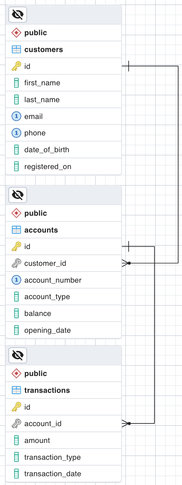

## ER Diagram



## Relational Schema

    customers(id, first_name, last_name, email, phone, date_of_birth, registered_on)
    accounts(id, customer_id, account_number, account_type, balance, opening_date)
    transactions(id, account_id, amount, transaction_type, transaction_date)

## SQL Statements
```sql
CREATE DATABASE bankdb;


CREATE TABLE customers (
    id SERIAL PRIMARY KEY,
    first_name VARCHAR(50) NOT NULL,
    last_name VARCHAR(50) NOT NULL,
    email VARCHAR(100) UNIQUE NOT NULL,
    phone VARCHAR(15) UNIQUE,
    date_of_birth DATE NOT NULL,
    registered_on TIMESTAMP DEFAULT CURRENT_TIMESTAMP
);


CREATE TABLE accounts (
                          id SERIAL PRIMARY KEY,
                          customer_id INTEGER NOT NULL,
                          account_number VARCHAR(15) UNIQUE NOT NULL,
                          account_type VARCHAR(20) CHECK (account_type IN ('Individual', 'Business')),
                          balance DECIMAL(15,2) CHECK (balance >= 0) DEFAULT 0.00,
                          opening_date TIMESTAMP DEFAULT CURRENT_TIMESTAMP,
                          FOREIGN KEY (customer_id) REFERENCES Customers(id) ON DELETE NO ACTION
);


CREATE TABLE transactions (
                              id SERIAL PRIMARY KEY,
                              account_id INTEGER NOT NULL,
                              amount DECIMAL(15,2) CHECK (amount > 0),
                              transaction_type VARCHAR(10) CHECK (transaction_type IN ('Deposit', 'Withdrawal')),
                              transaction_date TIMESTAMP DEFAULT CURRENT_TIMESTAMP,
                              FOREIGN KEY (account_id) REFERENCES Accounts(id) ON DELETE NO ACTION
);


-- Insert a valid customer
INSERT INTO Customers (first_name, last_name, email, phone, date_of_birth)
VALUES ('Alice', 'Smith', 'alice.smith@email.com', '9876543210', '1990-05-20');

-- Insert a valid account
INSERT INTO Accounts (customer_id, account_number, account_type, balance)
VALUES (1, '987654321098765', 'Business', 1000.00);

-- Insert a valid transaction
INSERT INTO Transactions (account_id, amount, transaction_type)
VALUES (1, 500.00, 'Deposit');

-- Verify records
SELECT * FROM Customers;
SELECT * FROM Accounts;
SELECT * FROM Transactions;


--Check constraints

INSERT INTO Customers (first_name, last_name, phone, date_of_birth)
VALUES ('John', 'Doe', '1234567890', '1985-07-15');
-- This should fail because email is NOT NULL

INSERT INTO Accounts (customer_id, account_number, account_type, balance)
VALUES (1, '123456789012345', 'Individual', -50.00);
-- This should fail due to CHECK (balance >= 0)

INSERT INTO Transactions (account_id, amount, transaction_type)
VALUES (1, 100.00, 'Transfer');
-- This should fail because 'Transfer' is not allowed in CHECK (transaction_type IN ('Deposit', 'Withdrawal'))

```
